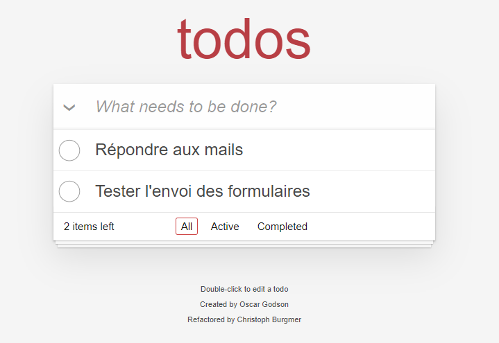

#Application Todos



##Description
- Cette application vous permet de lister vos tâches. 
- Vous pouvez toutes les affichées ou uniquement affichées celles qui sont en cours ou terminées.
- Il est possible de modifier l'intitulé de la tâche en double-cliquant dessus.
- Les tâches peuvent être supprimées individuellement.
- Les tâches terminées sont supprimables en un clique.

##Tester l'application
Vous pouvez tester l'application [ici](https://boris74000.github.io/OC-Projet-8-reprenez-et-ameliorez-un-projet-existant/ "").

##Récupérer l'application

Vous pouvez récupérer l'application en utilisant Git avec la commande ```git clone https://github.com/codebucks27/React-Redux-Todo-App.git```
ou en Téléchargeant le zip.

##Installer l'application

- Télécharger et installer [Node.js](https://nodejs.org/fr/download/ "download node.js").
- Vérifier que Node.js est bien installé en exécutant dans la console ```node -v ```.
- À la racine du projet, lancer la commande ``npm install``.
- Ouvrir le fichier index.html dans un navigateur.

#Technologies

Application qui repose sur une architecture MVC

- Javascript
- CSS
- HTML
- Jasmin

#Audit de performance
Audit de performance disponible [ici](https://github.com/Boris74000/OC-Projet-8-reprenez-et-ameliorez-un-projet-existant/blob/master/audit-todolistme/Audit%20de%20performance%20Todolistme.pdf "Audit de performance").
